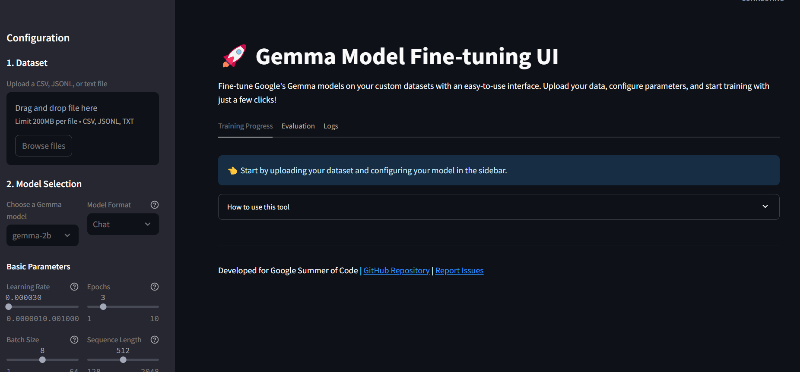

# 🚀 Gemma Model Fine-tuning UI

A comprehensive and user-friendly web interface for fine-tuning Google's Gemma models on custom datasets without requiring deep ML expertise.



## 🌟 Features

- 📂 **Dataset Management**
  - Support for CSV, JSONL, and text files
  - Automated validation and preprocessing
  - Data augmentation options
  - Dataset preview and statistics

- 🎛️ **Hyperparameter Configuration**
  - Intuitive UI for parameter adjustment
  - Sensible defaults with explanations
  - Configuration templates for common use cases
  - Parameter validation

- 📊 **Training Visualization**
  - Real-time loss curves
  - Evaluation metrics tracking
  - Resource utilization monitoring
  - Example generation during training

- 💾 **Model Export Options**
  - Download fine-tuned models in various formats (PyTorch, TensorFlow, GGUF)
  - Direct Hugging Face Hub integration
  - Model compression options
  - Deployment configuration generation

- ☁️ **Cloud Integration** (Coming Soon)
  - Google Cloud Storage support
  - Vertex AI training capabilities
  - Distributed training configuration
  - TPU acceleration options

## 📋 Prerequisites

- Python 3.8 or higher
- Access to Gemma models (requires [Google AI Studio access](https://ai.google.dev/models/gemma))
- For TPU support: GCP account with TPU access

## 🔧 Installation

1. Clone the repository:
   ```bash
   git clone https://github.com/Taskmaster-1/Gemma-Model-Fine-tuning-UI.git
   cd Gemma-Model-Fine-tuning-UI
   ```

2. Create a virtual environment:
   ```bash
   python -m venv venv
   source venv/bin/activate  # On Windows: venv\Scripts\activate
   ```

3. Install dependencies:
   ```bash
   pip install -r requirements.txt
   ```

4. Set up Gemma model access:
   - Generate an API key from [Google AI Studio](https://ai.google.dev/)
   - Configure your environment:
     ```bash
     export GOOGLE_API_KEY="your_api_key_here"
     # On Windows: set GOOGLE_API_KEY=your_api_key_here
     ```

## 🚀 Quick Start

1. Launch the application:
   ```bash
   streamlit run ui/app.py
   ```

2. Open your browser and navigate to `http://localhost:8501`

3. Upload your dataset, select a model, configure parameters, and start fine-tuning!

## 📚 Documentation

For detailed documentation, see the [docs](./docs) directory:
- [User Guide](./docs/user_guide.md) - Complete usage instructions
- [Developer Guide](./docs/developer_guide.md) - How to contribute and extend
- [API Reference](./docs/api_reference.md) - API documentation
- [Examples](./docs/examples) - Example use cases and workflows

## 🤝 Contributing

Contributions are welcome! This project is part of Google Summer of Code. See [CONTRIBUTING.md](CONTRIBUTING.md) for details on how to contribute.

## 📜 License

This project is licensed under the MIT License - see the [LICENSE](LICENSE) file for details.

## 🔗 Related Projects

- [Gemma](https://github.com/google/gemma) - Official Gemma repository
- [HuggingFace Transformers](https://github.com/huggingface/transformers) - Used for model implementation

## 📞 Contact

For questions or support, please open an issue or contact the author at [i.am.vivekyad5223@gmail.com](mailto:i.am.vivekyadav5223@gmail.com).

## 👏 Acknowledgements

- Google for creating and open-sourcing the Gemma models
- The Hugging Face team for their transformers library
- All contributors to this project
